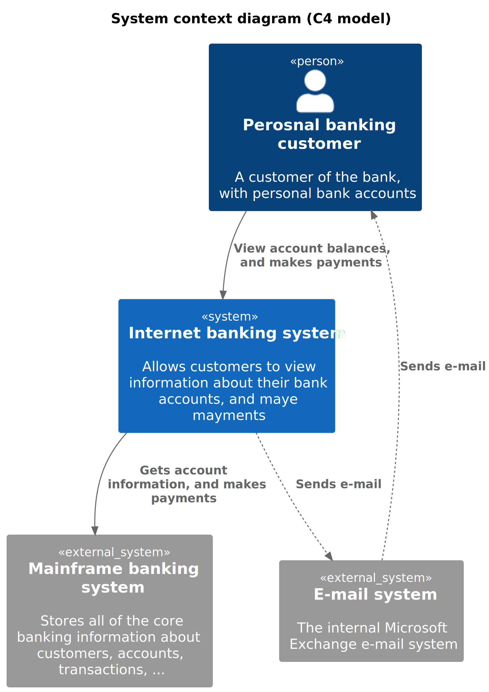
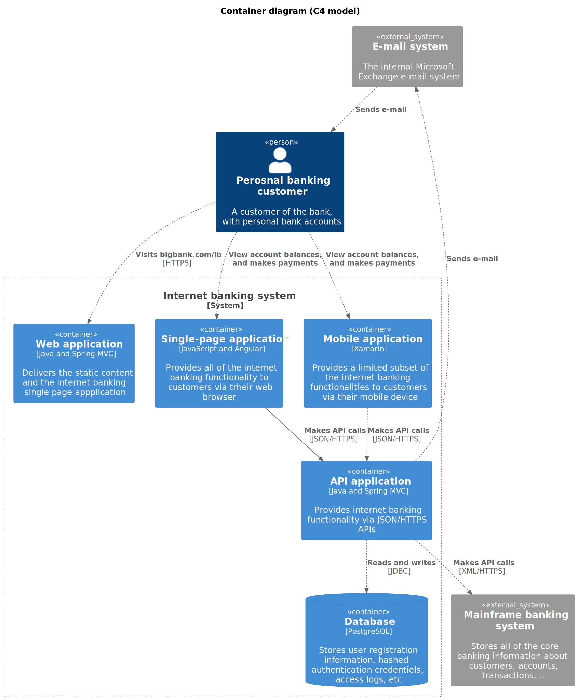
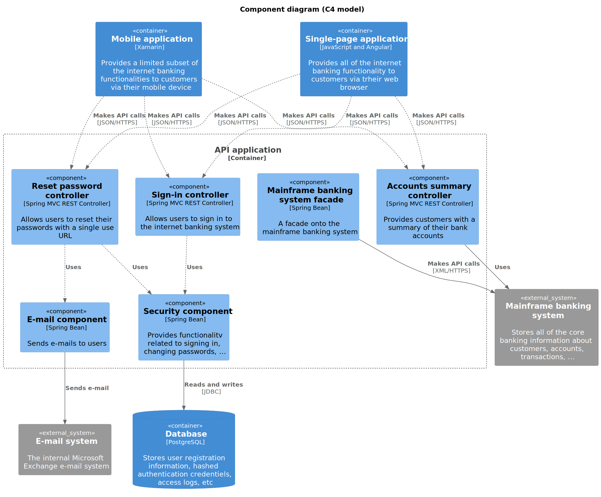

# C4 PlantUML boilerplate

## General

### Architecture

Architecture nomenclature is [based on the C4 model](https://c4model.com).

System context:



Container:



Component:



### Install

Documentation:

```
# Install PlantUML dependency
brew install graphviz
```

## Upgrade

Documentation:

1. Update `PLANTUML_VERSION` variable in the `Makefile` file
2. Launch `make docs-install` command

## [Authors](./AUTHORS.md)
